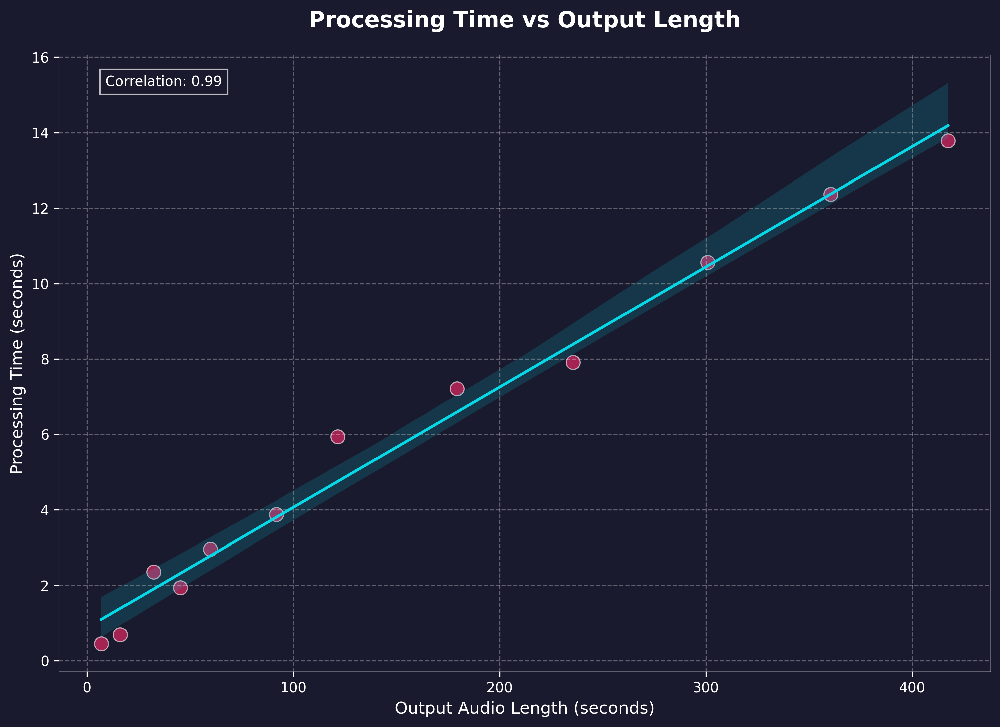
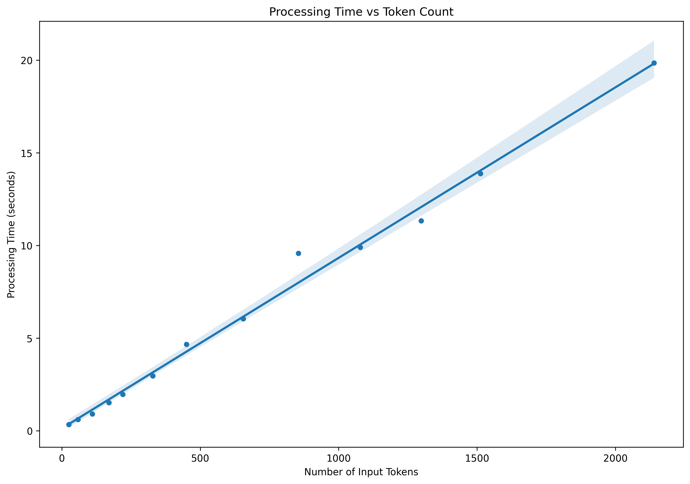

<p align="center">
  
</p>

# Kokoro TTS API
[](https://huggingface.co/hexgrad/Kokoro-82M/tree/a67f11354c3e38c58c3327498bc4bd1e57e71c50)

FastAPI wrapper for [Kokoro-82M](https://huggingface.co/hexgrad/Kokoro-82M) text-to-speech model. 

Dockerized with NVIDIA GPU support, simple queue handling via sqllite, and automatic chunking/stitching on lengthy input/outputs

## Quick Start

```bash
# Start the API (will automatically clone source HF repo via git-lfs)
docker compose up --build
```

Test it out:
```bash
# From host terminal
python examples/test_tts.py "Hello world" --voice af_bella
```

## Performance Benchmarks

Benchmarking was performed soley on generation via the API (no download) using various text lengths from 100 to ~10,000 characters, measuring processing time, token count, and output audio length. Tests were run on: 
- NVIDIA 4060Ti 16gb GPU @ CUDA 12.1
- 11th Gen i7-11700 @ 2.5GHz
- 64gb RAM
- Randomized chunks from H.G. Wells - The Time Machine

<p align="center">
  
  
</p>


- Average processing speed: ~3.4 seconds per minute of audio output
- Efficient token processing: ~0.01 seconds per token
- Scales well with longer texts, maintains consistent performance

## API Endpoints

```bash
GET /tts/voices           # List available voices
POST /tts                 # Generate speech
GET /tts/{request_id}     # Check generation status
GET /tts/file/{request_id} # Download audio file
```

## Example Usage

List available voices:
```bash
python examples/test_tts.py
```

Generate speech:
```bash
# Default voice
python examples/test_tts.py "Your text here"

# Specific voice
python examples/test_tts.py --voice af_bella "Your text here"

# Get file path without downloading
python examples/test_tts.py --no-download "Your text here"
```

Generated files are saved in:
- With download: `examples/output/`
- Without download: `src/output/` (in API container)

## Requirements

- Docker
- NVIDIA GPU + CUDA
- nvidia-container-toolkit installed on host

## Model

This API uses the [Kokoro-82M](https://huggingface.co/hexgrad/Kokoro-82M) model from HuggingFace. 

Visit the model page for more details about training, architecture, and capabilities. I have no affiliation with any of their work, and produced this wrapper for ease of use and personal projects.

## License

This project is licensed under the Apache License 2.0 - see below for details:

- The Kokoro model weights are licensed under Apache 2.0 (see [model page](https://huggingface.co/hexgrad/Kokoro-82M))
- The FastAPI wrapper code in this repository is licensed under Apache 2.0 to match
- The inference code adapted from StyleTTS2 is MIT licensed

The full Apache 2.0 license text can be found at: https://www.apache.org/licenses/LICENSE-2.0
