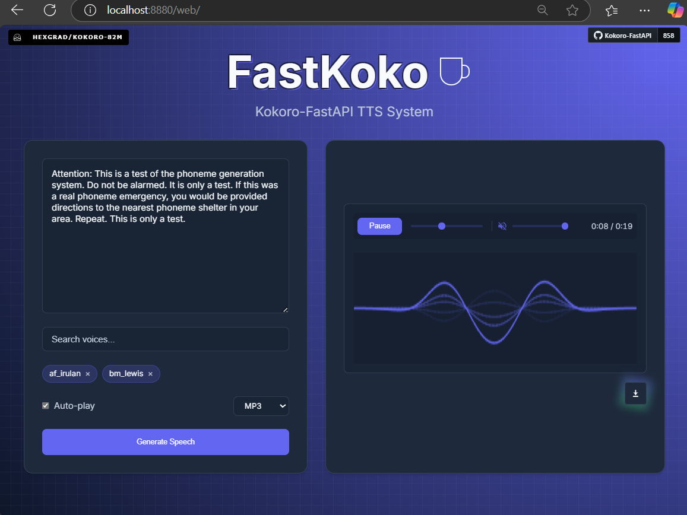
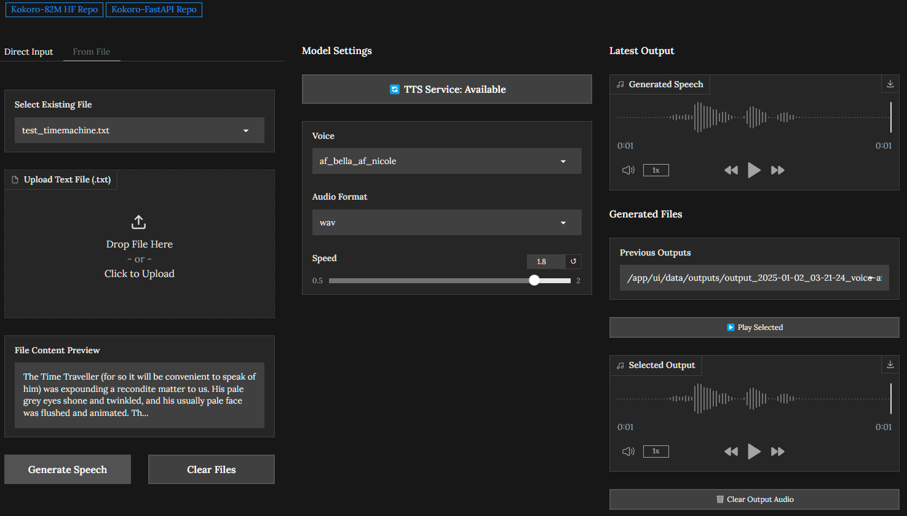

<p align="center">
  
</p>

# <sub><sub>_`FastKoko`_ </sub></sub>
[]()
[]()
[](https://huggingface.co/hexgrad/Kokoro-82M/tree/c3b0d86e2a980e027ef71c28819ea02e351c2667) [](https://huggingface.co/spaces/Remsky/Kokoro-TTS-Zero)

> Pre-release. Not fully tested

Dockerized FastAPI wrapper for [Kokoro-82M](https://huggingface.co/hexgrad/Kokoro-82M) text-to-speech model
- OpenAI-compatible Speech endpoint, with inline voice combination, and mapped naming/models for strict systems
- NVIDIA GPU accelerated or CPU inference (ONNX, Pytorch) 
- very fast generation time
  - 35x-100x+ real time speed via 4060Ti+
  - 5x+ real time speed via M3 Pro CPU
- streaming support w/ variable chunking to control latency, (new) improved concurrency
- phoneme based dev endpoints
- (new) Integrated web UI on localhost:8880/web

> [!Tip]
> You can try the new beta version from the `v0.1.2-pre` branch now:
<table>
  <tr>
    <td>
      
    </td>
    <td>
      <ul>
        <li>Integrated web UI (on localhost:8880/web)</li>
        <li>Better concurrency handling, baked in models and voices</li>
        <li>Voice name/model mappings to OAI standard</li>
        <pre> # with:
docker run -p 8880:8880 ghcr.io/remsky/kokoro-fastapi-cpu:latest # CPU
docker run --gpus all -p 8880:8880 ghcr.io/remsky/kokoro-fastapi-gpu:latest # Nvidia GPU
        </pre>
      </ul>
    </td>
  </tr>
</table>

<details open>
<summary>Quick Start</summary>

The service can be accessed through either the API endpoints or the Gradio web interface.

1. Install prerequisites, and start the service using Docker Compose (Full setup including UI):
   - Install [Docker](https://www.docker.com/products/docker-desktop/)

   - Clone the repository:
        ```bash
        git clone https://github.com/remsky/Kokoro-FastAPI.git
        cd Kokoro-FastAPI

        cd docker/gpu # OR 
        # cd docker/cpu # Run this or the above
        docker compose up --build 
        # if you are missing any models, run the .py or .sh scrips in the respective folders
        ```
        
      Once started:
     - The API will be available at http://localhost:8880
     - The *Web UI* can be tested at http://localhost:8880/web
     - The Gradio UI (deprecating) can be accessed at http://localhost:7860
        
    __Or__ running the API alone using Docker (model + voice packs baked in) (Most Recent):
          
    ```bash
    docker run -p 8880:8880 ghcr.io/remsky/kokoro-fastapi-cpu:v0.1.2 # CPU 
    docker run --gpus all -p 8880:8880 ghcr.io/remsky/kokoro-fastapi-gpu:v0.1.2 # Nvidia GPU
    ```
        
        
2. Run locally as an OpenAI-Compatible Speech Endpoint
    ```python
    from openai import OpenAI
    client = OpenAI(
        base_url="http://localhost:8880/v1",
        api_key="not-needed"
        )

    with client.audio.speech.with_streaming_response.create(
        model="kokoro", 
        voice="af_sky+af_bella", #single or multiple voicepack combo
        input="Hello world!",
        response_format="mp3"
    ) as response:
        response.stream_to_file("output.mp3")
    
    ```

  <div align="center">
    <div style="display: flex; justify-content: center; gap: 20px;">
      
      
    </div>
  </div>

## Features 
<details>
<summary>OpenAI-Compatible Speech Endpoint</summary>

```python
# Using OpenAI's Python library
from openai import OpenAI
client = OpenAI(base_url="http://localhost:8880/v1", api_key="not-needed")
response = client.audio.speech.create(
    model="kokoro",  
    voice="af_bella+af_sky", # see /api/src/core/openai_mappings.json to customize
    input="Hello world!",
    response_format="mp3"
)

response.stream_to_file("output.mp3")
```
Or Via Requests:
```python
import requests


response = requests.get("http://localhost:8880/v1/audio/voices")
voices = response.json()["voices"]

# Generate audio
response = requests.post(
    "http://localhost:8880/v1/audio/speech",
    json={
        "model": "kokoro",  
        "input": "Hello world!",
        "voice": "af_bella",
        "response_format": "mp3",  # Supported: mp3, wav, opus, flac
        "speed": 1.0
    }
)

# Save audio
with open("output.mp3", "wb") as f:
    f.write(response.content)
```

Quick tests (run from another terminal):
```bash
python examples/assorted_checks/test_openai/test_openai_tts.py # Test OpenAI Compatibility
python examples/assorted_checks/test_voices/test_all_voices.py # Test all available voices
```
</details>

<details>
<summary>Voice Combination</summary>

- Averages model weights of any existing voicepacks
- Saves generated voicepacks for future use
- (new) Available through any endpoint, simply concatenate desired packs with "+"

Combine voices and generate audio:
```python
import requests
response = requests.get("http://localhost:8880/v1/audio/voices")
voices = response.json()["voices"]

# Create combined voice (saves locally on server)
response = requests.post(
    "http://localhost:8880/v1/audio/voices/combine",
    json=[voices[0], voices[1]]
)
combined_voice = response.json()["voice"]

# Generate audio with combined voice (or, simply pass multiple directly with `+` )
response = requests.post(
    "http://localhost:8880/v1/audio/speech",
    json={
        "input": "Hello world!",
        "voice": combined_voice, # or skip the above step with f"{voices[0]}+{voices[1]}"
        "response_format": "mp3"
    }
)
```
<p align="center">
  
</p>
</details>

<details>
<summary>Multiple Output Audio Formats</summary>

- mp3
- wav
- opus 
- flac
- aac
- pcm

<p align="center">

</p>

</details>

<details>
<summary>Gradio Web Utility</summary>

Access the interactive web UI at http://localhost:7860 after starting the service. Features include:
- Voice/format/speed selection
- Audio playback and download
- Text file or direct input

If you only want the API, just comment out everything in the docker-compose.yml under and including `gradio-ui`

Currently, voices created via the API are accessible here, but voice combination/creation has not yet been added

Running the UI Docker Service
   - If you only want to run the Gradio web interface separately and connect it to an existing API service:
      ```bash
      docker run -p 7860:7860 \
        -e API_HOST=<api-hostname-or-ip> \
        -e API_PORT=8880 \
        ghcr.io/remsky/kokoro-fastapi-ui:v0.1.0
      ```

     - Replace `<api-hostname-or-ip>` with:
       - `kokoro-tts` if the UI container is running in the same Docker Compose setup.
       - `localhost` if the API is running on your local machine.
  
### Disabling Local Saving

You can disable local saving of audio files and hide the file view in the UI by setting the `DISABLE_LOCAL_SAVING` environment variable to `true`. This is useful when running the service on a server where you don't want to store generated audio files locally.

When using Docker Compose:
```yaml
environment:
  - DISABLE_LOCAL_SAVING=true
```

When running the Docker image directly:
```bash
docker run -p 7860:7860 -e DISABLE_LOCAL_SAVING=true ghcr.io/remsky/kokoro-fastapi-ui:latest
```
</details>

<details>
<summary>Streaming Support</summary>

```python
# OpenAI-compatible streaming
from openai import OpenAI
client = OpenAI(
    base_url="http://localhost:8880", api_key="not-needed")

# Stream to file
with client.audio.speech.with_streaming_response.create(
    model="kokoro",
    voice="af_bella",
    input="Hello world!"
) as response:
    response.stream_to_file("output.mp3")

# Stream to speakers (requires PyAudio)
import pyaudio
player = pyaudio.PyAudio().open(
    format=pyaudio.paInt16, 
    channels=1, 
    rate=24000, 
    output=True
)

with client.audio.speech.with_streaming_response.create(
    model="kokoro",
    voice="af_bella",
    response_format="pcm",
    input="Hello world!"
) as response:
    for chunk in response.iter_bytes(chunk_size=1024):
        player.write(chunk)
```

Or via requests:
```python
import requests

response = requests.post(
    "http://localhost:8880/v1/audio/speech",
    json={
        "input": "Hello world!",
        "voice": "af_bella",
        "response_format": "pcm"
    },
    stream=True
)

for chunk in response.iter_content(chunk_size=1024):
    if chunk:
        # Process streaming chunks
        pass
```

<p align="center">
  
  
</p>

Key Streaming Metrics:
- First token latency @ chunksize
    - ~300ms  (GPU) @ 400 
    - ~3500ms (CPU) @ 200 (older i7)
    - ~<1s    (CPU) @ 200 (M3 Pro)
- Adjustable chunking settings for real-time playback 

*Note: Artifacts in intonation can increase with smaller chunks*
</details>

## Processing Details
<details>
<summary>Performance Benchmarks</summary>

Benchmarking was performed on generation via the local API using text lengths up to feature-length books (~1.5 hours output), measuring processing time and realtime factor. Tests were run on: 
- Windows 11 Home w/ WSL2 
- NVIDIA 4060Ti 16gb GPU @ CUDA 12.1
- 11th Gen i7-11700 @ 2.5GHz
- 64gb RAM
- WAV native output
- H.G. Wells - The Time Machine (full text)

<p align="center">
  
  
</p>

Key Performance Metrics:
- Realtime Speed: Ranges between 25-50x (generation time to output audio length)
- Average Processing Rate: 137.67 tokens/second (cl100k_base)
</details>
<details>
<summary>GPU Vs. CPU</summary>

```bash
# GPU: Requires NVIDIA GPU with CUDA 12.1 support (~35x realtime speed)
docker compose up --build

# CPU: ONNX optimized inference (~2.4x realtime speed)
docker compose -f docker-compose.cpu.yml up --build
```
*Note: Overall speed may have reduced somewhat with the structural changes to accomodate streaming. Looking into it* 
</details>

<details>
<summary>Natural Boundary Detection</summary>

- Automatically splits and stitches at sentence boundaries 
- Helps to reduce artifacts and allow long form processing as the base model is only currently configured for approximately 30s output 
</details>

<details>
<summary>Phoneme & Token Routes</summary>

Convert text to phonemes and/or generate audio directly from phonemes:
```python
import requests

# Convert text to phonemes
response = requests.post(
    "http://localhost:8880/dev/phonemize",
    json={
        "text": "Hello world!",
        "language": "a"  # "a" for American English
    }
)
result = response.json()
phonemes = result["phonemes"]  # Phoneme string e.g  ðɪs ɪz ˈoʊnli ɐ tˈɛst
tokens = result["tokens"]      # Token IDs including start/end tokens 

# Generate audio from phonemes
response = requests.post(
    "http://localhost:8880/dev/generate_from_phonemes",
    json={
        "phonemes": phonemes,
        "voice": "af_bella",
        "speed": 1.0
    }
)

# Save WAV audio
with open("speech.wav", "wb") as f:
    f.write(response.content)
```

See `examples/phoneme_examples/generate_phonemes.py` for a sample script.
</details>

## Known Issues

<details>
<summary>Versioning & Development</summary>

I'm doing what I can to keep things stable, but we are on an early and rapid set of build cycles here.
If you run into trouble, you may have to roll back a version on the release tags if something comes up, or build up from source and/or troubleshoot + submit a PR. Will leave the branch up here for the last known stable points:

`v0.0.5post1`

Free and open source is a community effort, and I love working on this project, though there's only really so many hours in a day. If you'd like to support the work, feel free to open a PR, buy me a coffee, or report any bugs/features/etc you find during use.

  <a href="https://www.buymeacoffee.com/remsky" target="_blank">
    
  </a>

  
</details>

<details>
<summary>Linux GPU Permissions</summary>

Some Linux users may encounter GPU permission issues when running as non-root. 
Can't guarantee anything, but here are some common solutions, consider your security requirements carefully

### Option 1: Container Groups (Likely the best option)
```yaml
services:
  kokoro-tts:
    # ... existing config ...
    group_add:
      - "video"
      - "render"
```

### Option 2: Host System Groups
```yaml
services:
  kokoro-tts:
    # ... existing config ...
    user: "${UID}:${GID}"
    group_add:
      - "video"
```
Note: May require adding host user to groups: `sudo usermod -aG docker,video $USER` and system restart.

### Option 3: Device Permissions (Use with caution)
```yaml
services:
  kokoro-tts:
    # ... existing config ...
    devices:
      - /dev/nvidia0:/dev/nvidia0
      - /dev/nvidiactl:/dev/nvidiactl
      - /dev/nvidia-uvm:/dev/nvidia-uvm
```
⚠️ Warning: Reduces system security. Use only in development environments.

Prerequisites: NVIDIA GPU, drivers, and container toolkit must be properly configured.

Visit [NVIDIA Container Toolkit installation](https://docs.nvidia.com/datacenter/cloud-native/container-toolkit/latest/install-guide.html) for more detailed information

</details>

## Model and License

<details open>
<summary>Model</summary>

This API uses the [Kokoro-82M](https://huggingface.co/hexgrad/Kokoro-82M) model from HuggingFace. 

Visit the model page for more details about training, architecture, and capabilities. I have no affiliation with any of their work, and produced this wrapper for ease of use and personal projects.
</details>
<details>
<summary>License</summary>
This project is licensed under the Apache License 2.0 - see below for details:

- The Kokoro model weights are licensed under Apache 2.0 (see [model page](https://huggingface.co/hexgrad/Kokoro-82M))
- The FastAPI wrapper code in this repository is licensed under Apache 2.0 to match
- The inference code adapted from StyleTTS2 is MIT licensed

The full Apache 2.0 license text can be found at: https://www.apache.org/licenses/LICENSE-2.0
</details>
