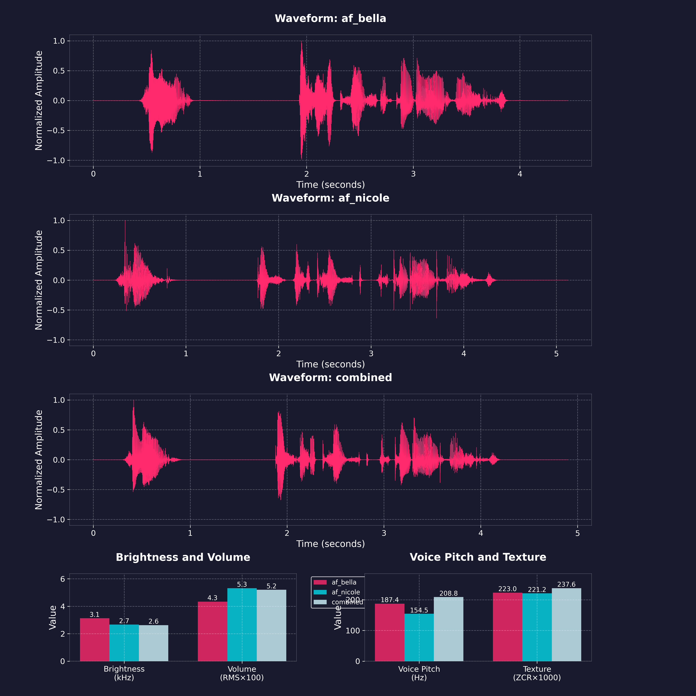
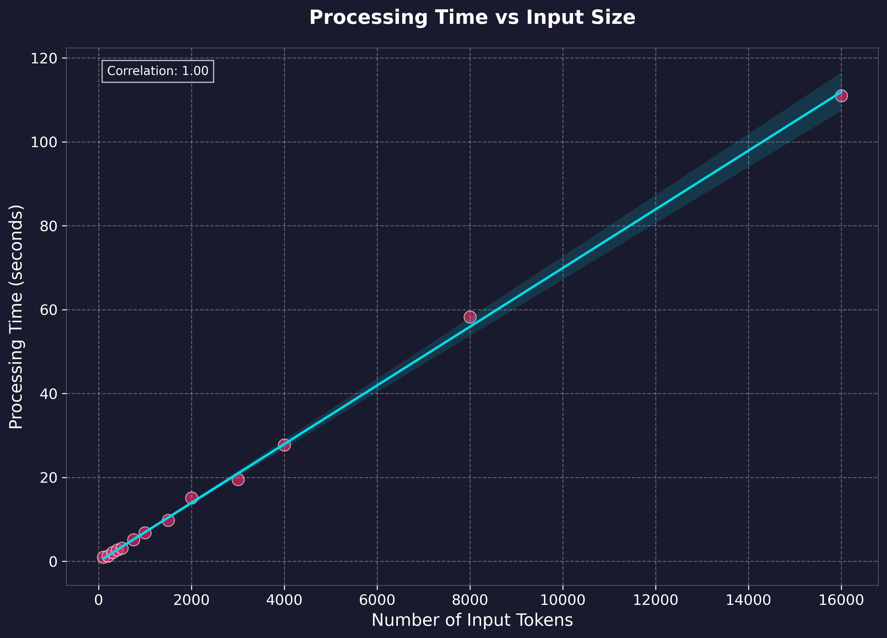
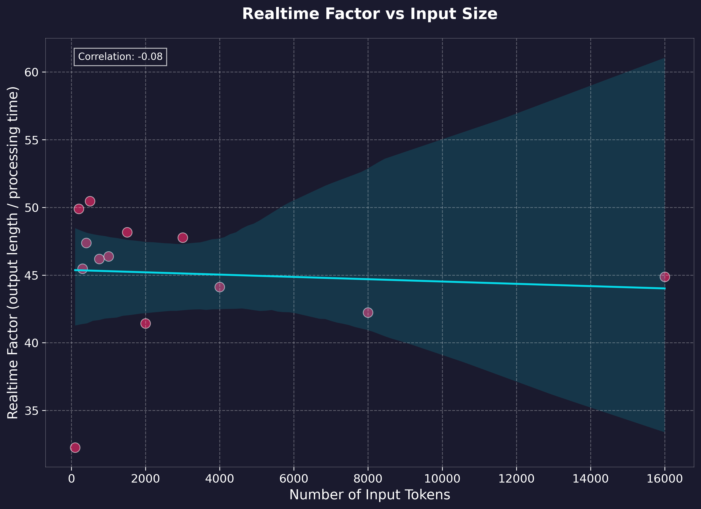

<p align="center">
  
</p>

# Kokoro TTS API
[]()
[]()
[](https://huggingface.co/hexgrad/Kokoro-82M/tree/c3b0d86e2a980e027ef71c28819ea02e351c2667)

Dockerized FastAPI wrapper for [Kokoro-82M](https://huggingface.co/hexgrad/Kokoro-82M) text-to-speech model
- OpenAI-compatible Speech endpoint, with voice combination functionality
- NVIDIA GPU accelerated inference (or CPU) option
- very fast generation time (~35x real time factor)
- automatic chunking/stitching for long texts
- simple audio generation web ui utility

<details open>
<summary><b>OpenAI-Compatible Speech Endpoint</b></summary>

The service can be accessed through either the API endpoints or the Gradio web interface.

1. Install prerequisites:
   - Install [Docker Desktop](https://www.docker.com/products/docker-desktop/) + [Git](https://git-scm.com/downloads)
   - Clone and start the service:
        ```bash
        git clone https://github.com/remsky/Kokoro-FastAPI.git
        cd Kokoro-FastAPI
        docker compose up --build
        ```
2. Run locally as an OpenAI-Compatible Speech Endpoint
    ```python
    from openai import OpenAI
    client = OpenAI(
        base_url="http://localhost:8880",
        api_key="not-needed"
        )

    response = client.audio.speech.create(
        model="kokoro", 
        voice="af_bella",
        input="Hello world!",
        response_format="mp3"
    )
    response.stream_to_file("output.mp3")
    ```

    or visit http://localhost:7860
    <p align="center">
    
    </p>
</details>
<details>
<summary><b>OpenAI-Compatible Speech Endpoint</b></summary>

```python
# Using OpenAI's Python library
from openai import OpenAI
client = OpenAI(base_url="http://localhost:8880", api_key="not-needed")
response = client.audio.speech.create(
    model="kokoro",  # Not used but required for compatibility, also accepts library defaults
    voice="af_bella",
    input="Hello world!",
    response_format="mp3"
)

response.stream_to_file("output.mp3")
```
Or Via Requests:
```python
import requests


response = requests.get("http://localhost:8880/v1/audio/voices")
voices = response.json()["voices"]

# Generate audio
response = requests.post(
    "http://localhost:8880/v1/audio/speech",
    json={
        "model": "kokoro",  # Not used but required for compatibility
        "input": "Hello world!",
        "voice": "af_bella",
        "response_format": "mp3",  # Supported: mp3, wav, opus, flac
        "speed": 1.0
    }
)

# Save audio
with open("output.mp3", "wb") as f:
    f.write(response.content)
```

Quick tests (run from another terminal):
```bash
python examples/test_openai_tts.py # Test OpenAI Compatibility
python examples/test_all_voices.py # Test all available voices
```
</details>

<details>
<summary><b>Voice Combination</b></summary>

Combine voices and generate audio:
```python
import requests
response = requests.get("http://localhost:8880/v1/audio/voices")
voices = response.json()["voices"]

# Create combined voice (saves locally on server)
response = requests.post(
    "http://localhost:8880/v1/audio/voices/combine",
    json=[voices[0], voices[1]]
)
combined_voice = response.json()["voice"]

# Generate audio with combined voice
response = requests.post(
    "http://localhost:8880/v1/audio/speech",
    json={
        "input": "Hello world!",
        "voice": combined_voice,
        "response_format": "mp3"
    }
)
```
<p align="center">
  
</p>
</details>

<details>
<summary><b>Gradio Web Utility</b></summary>

Access the interactive web UI at http://localhost:7860 after starting the service. Features include:
- Voice/format/speed selection
- Audio playback and download
- Text file or direct input

If you only want the API, just comment out everything in the docker-compose.yml under and including `gradio-ui`

Currently, voices created via the API are accessible here, but voice combination/creation has not yet been added
</details>


<details>
<summary><b>Performance Benchmarks</b></summary>

Benchmarking was performed on generation via the local API using text lengths up to feature-length books (~1.5 hours output), measuring processing time and realtime factor. Tests were run on: 
- Windows 11 Home w/ WSL2 
- NVIDIA 4060Ti 16gb GPU @ CUDA 12.1
- 11th Gen i7-11700 @ 2.5GHz
- 64gb RAM
- WAV native output
- H.G. Wells - The Time Machine (full text)

<p align="center">
  
  
</p>

Key Performance Metrics:
- Realtime Factor: Ranges between 35-49x (generation time to output audio length)
- Average Processing Rate: 137.67 tokens/second (cl100k_base)
</details>
<details>
<summary><b>GPU Vs. CPU<b></summary>

```bash
# GPU: Requires NVIDIA GPU with CUDA 12.1 support
docker compose up --build

# CPU: ~10x slower than GPU inference
docker compose -f docker-compose.cpu.yml up --build
```
</details>
<details>
<summary><b>Features</b></summary>

- OpenAI-compatible API endpoints (with optional Gradio Web UI)
- GPU-accelerated inference (if desired)
- Multiple audio formats: mp3, wav, opus, flac, (aac & pcm not implemented)
- Natural Boundary Detection:
    - Automatically splits and stitches at sentence boundaries to reduce artifacts and maintain performacne
- Voice Combination:
    - Averages model weights of any existing voicepacks
    - Saves generated voicepacks for future use


*Note: CPU Inference is currently a very basic implementation, and not heavily tested*
</details>

<details open>
<summary><b>Model</b></summary>

This API uses the [Kokoro-82M](https://huggingface.co/hexgrad/Kokoro-82M) model from HuggingFace. 

Visit the model page for more details about training, architecture, and capabilities. I have no affiliation with any of their work, and produced this wrapper for ease of use and personal projects.
</details>

<details>
<summary><b>License</b></summary>

This project is licensed under the Apache License 2.0 - see below for details:

- The Kokoro model weights are licensed under Apache 2.0 (see [model page](https://huggingface.co/hexgrad/Kokoro-82M))
- The FastAPI wrapper code in this repository is licensed under Apache 2.0 to match
- The inference code adapted from StyleTTS2 is MIT licensed

The full Apache 2.0 license text can be found at: https://www.apache.org/licenses/LICENSE-2.0
</details>
