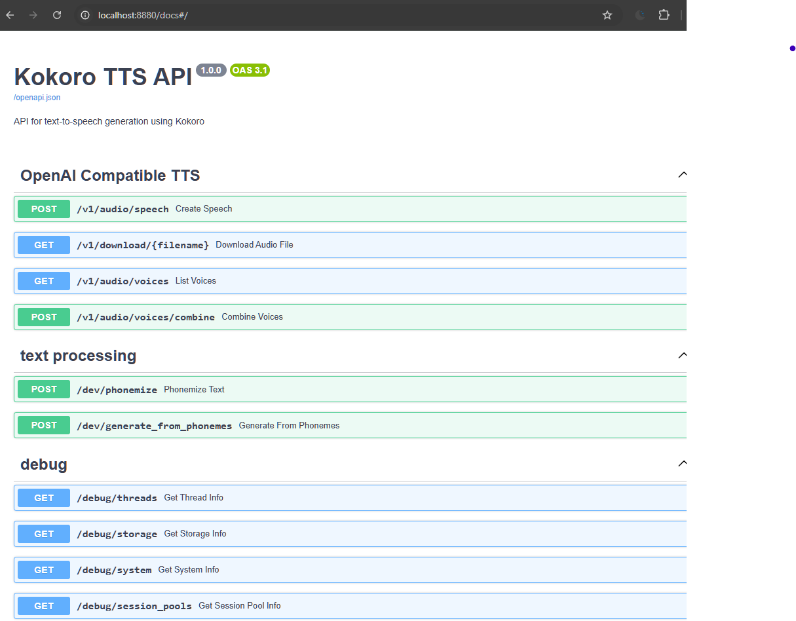
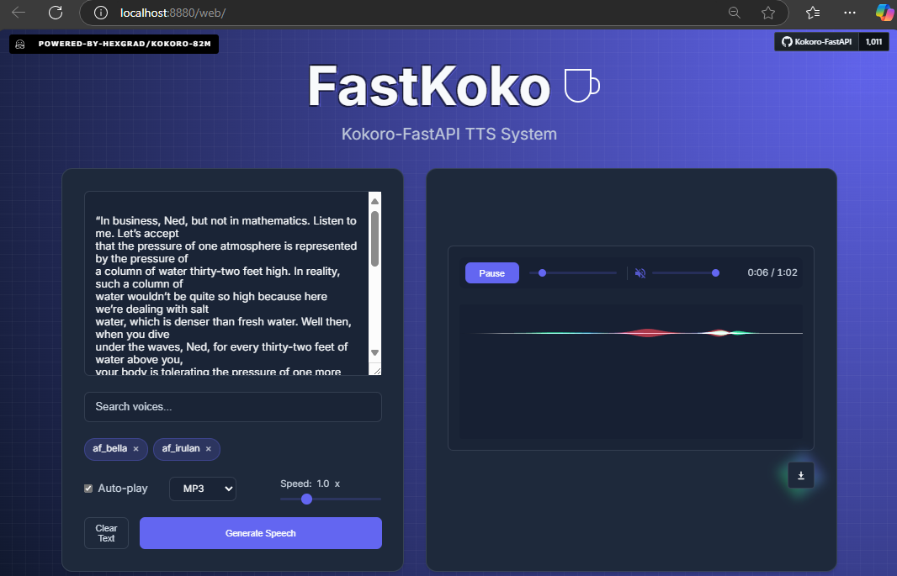
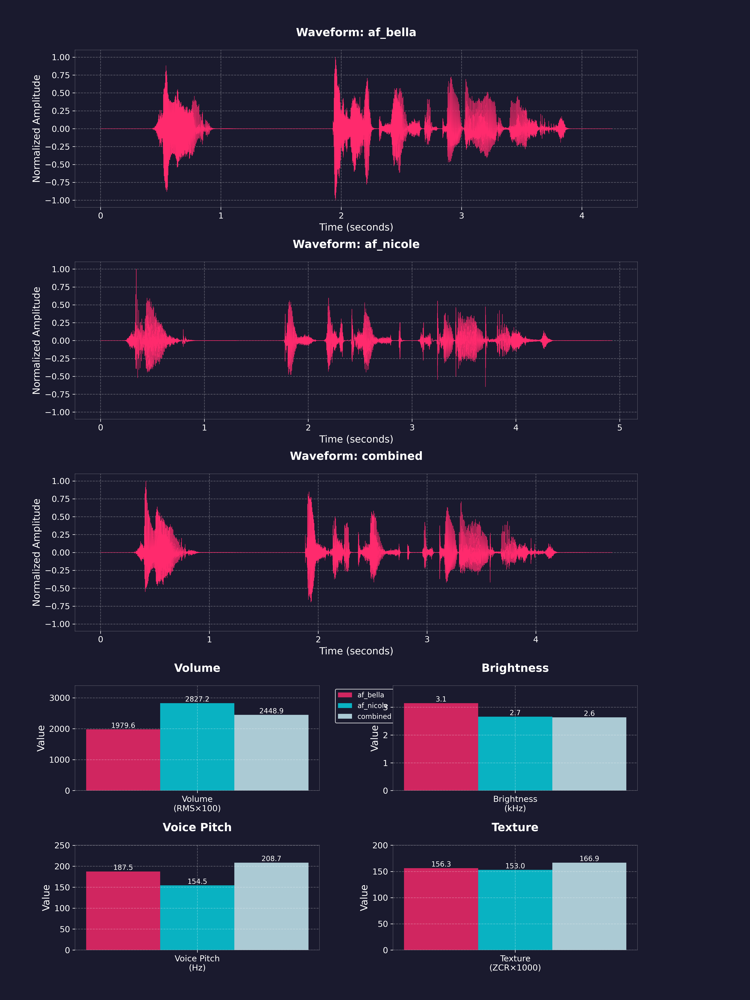
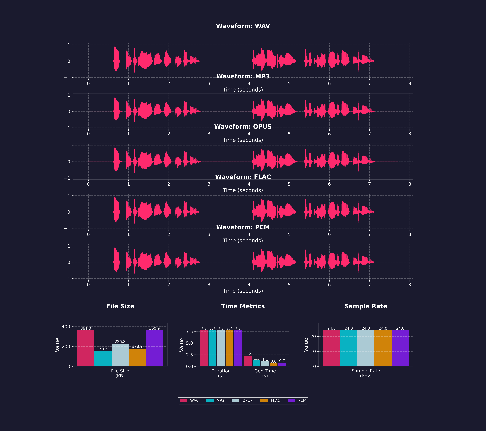
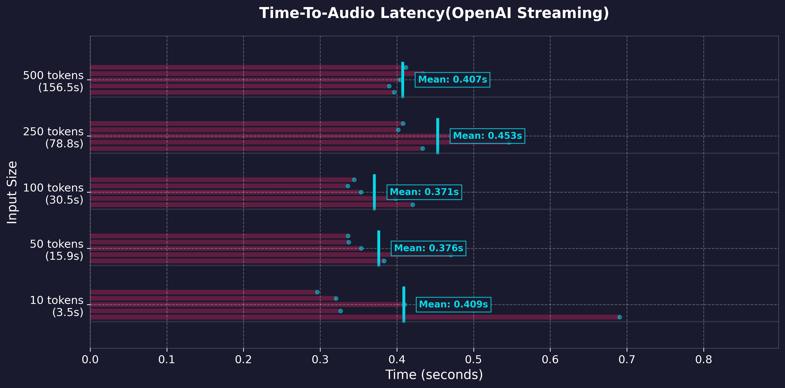
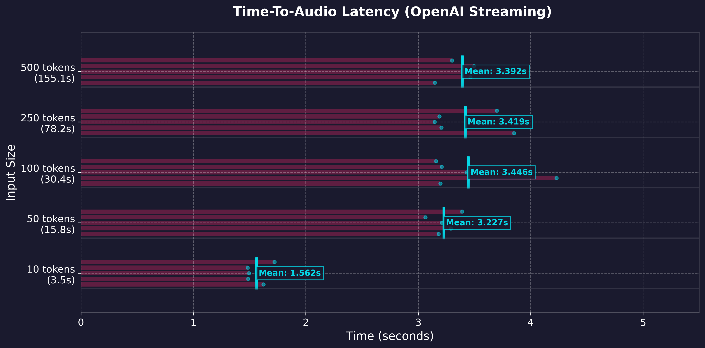
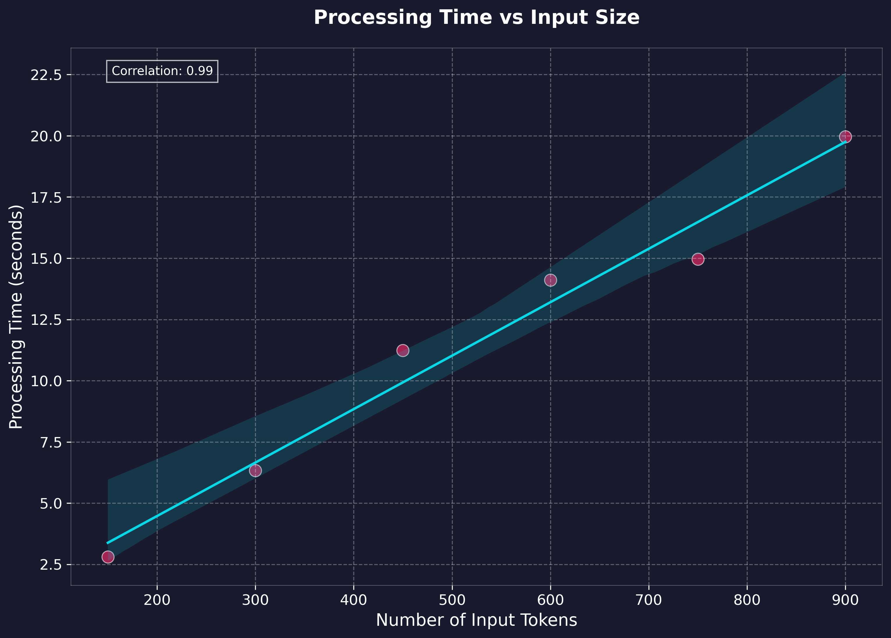
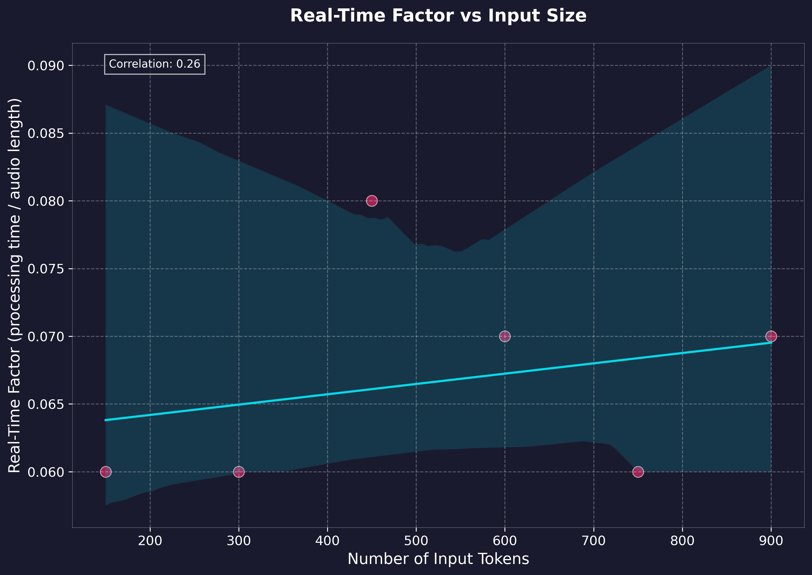

<p align="center">
  
</p>

# <sub><sub>_`FastKoko`_ </sub></sub>
[]()
[]()
[](https://huggingface.co/spaces/Remsky/Kokoro-TTS-Zero)

[](https://github.com/hexgrad/kokoro)
[](https://github.com/hexgrad/misaki)

[](https://huggingface.co/hexgrad/Kokoro-82M/commit/9901c2b79161b6e898b7ea857ae5298f47b8b0d6)

Dockerized FastAPI wrapper for [Kokoro-82M](https://huggingface.co/hexgrad/Kokoro-82M) text-to-speech model
- Multi-language support (English, Japanese, Korean, Chinese, _Vietnamese soon_)
- OpenAI-compatible Speech endpoint, NVIDIA GPU accelerated or CPU inference with PyTorch 
- ONNX support coming soon, see v0.1.5 and earlier for legacy ONNX support in the interim
- Debug endpoints for monitoring system stats, integrated web UI on localhost:8880/web
- Phoneme-based audio generation, phoneme generation
- Per-word timestamped caption generation
- Voice mixing with weighted combinations

### Integration Guides
 [](https://github.com/remsky/Kokoro-FastAPI/wiki/Setup-Kubernetes) [](https://github.com/remsky/Kokoro-FastAPI/wiki/Integrations-DigitalOcean) [](https://github.com/remsky/Kokoro-FastAPI/wiki/Integrations-SillyTavern)
[](https://github.com/remsky/Kokoro-FastAPI/wiki/Integrations-OpenWebUi)
## Get Started

<details>
<summary>Quickest Start (docker run)</summary>


Pre built images are available to run, with arm/multi-arch support, and baked in models
Refer to the core/config.py file for a full list of variables which can be managed via the environment

```bash
# the `latest` tag can be used, though it may have some unexpected bonus features which impact stability.
 Named versions should be pinned for your regular usage.
 Feedback/testing is always welcome

docker run -p 8880:8880 ghcr.io/remsky/kokoro-fastapi-cpu:latest # CPU, or:
docker run --gpus all -p 8880:8880 ghcr.io/remsky/kokoro-fastapi-gpu:latest  #NVIDIA GPU
```


</details>

<details>

<summary>Quick Start (docker compose) </summary>

1. Install prerequisites, and start the service using Docker Compose (Full setup including UI):
   - Install [Docker](https://www.docker.com/products/docker-desktop/)
   - Clone the repository:
        ```bash
        git clone https://github.com/remsky/Kokoro-FastAPI.git
        cd Kokoro-FastAPI

        cd docker/gpu  # For GPU support
        # or cd docker/cpu  # For CPU support
        docker compose up --build

        # *Note for Apple Silicon (M1/M2) users:
        # The current GPU build relies on CUDA, which is not supported on Apple Silicon.  
        # If you are on an M1/M2/M3 Mac, please use the `docker/cpu` setup.  
        # MPS (Apple's GPU acceleration) support is planned but not yet available.

        # Models will auto-download, but if needed you can manually download:
        python docker/scripts/download_model.py --output api/src/models/v1_0

        # Or run directly via UV:
        ./start-gpu.sh  # For GPU support
        ./start-cpu.sh  # For CPU support
        ```
</details>
<details>
<summary>Direct Run (via uv) </summary>

1. Install prerequisites ():
   - Install [astral-uv](https://docs.astral.sh/uv/)
   - Install [espeak-ng](https://github.com/espeak-ng/espeak-ng) in your system if you want it available as a fallback for unknown words/sounds. The upstream libraries may attempt to handle this, but results have varied.
   - Clone the repository:
        ```bash
        git clone https://github.com/remsky/Kokoro-FastAPI.git
        cd Kokoro-FastAPI
        ```
        
        Run the [model download script](https://github.com/remsky/Kokoro-FastAPI/blob/master/docker/scripts/download_model.py) if you haven't already
     
        Start directly via UV (with hot-reload)
        
        Linux and macOS
        ```bash
        ./start-cpu.sh OR
        ./start-gpu.sh 
        ```

        Windows
        ```powershell
        .\start-cpu.ps1 OR
        .\start-gpu.ps1 
        ```

</details>

<details open>
<summary> Up and Running? </summary>


Run locally as an OpenAI-Compatible Speech Endpoint
    
```python
from openai import OpenAI

client = OpenAI(
    base_url="http://localhost:8880/v1", api_key="not-needed"
)

with client.audio.speech.with_streaming_response.create(
    model="kokoro",
    voice="af_sky+af_bella", #single or multiple voicepack combo
    input="Hello world!"
  ) as response:
      response.stream_to_file("output.mp3")
```
  
- The API will be available at http://localhost:8880
- API Documentation: http://localhost:8880/docs

- Web Interface: http://localhost:8880/web

<div align="center" style="display: flex; justify-content: center; gap: 10px;">
  
  
</div>

</details>

## Features 

<details>
<summary>OpenAI-Compatible Speech Endpoint</summary>

```python
# Using OpenAI's Python library
from openai import OpenAI
client = OpenAI(base_url="http://localhost:8880/v1", api_key="not-needed")
response = client.audio.speech.create(
    model="kokoro",  
    voice="af_bella+af_sky", # see /api/src/core/openai_mappings.json to customize
    input="Hello world!",
    response_format="mp3"
)

response.stream_to_file("output.mp3")
```
Or Via Requests:
```python
import requests


response = requests.get("http://localhost:8880/v1/audio/voices")
voices = response.json()["voices"]

# Generate audio
response = requests.post(
    "http://localhost:8880/v1/audio/speech",
    json={
        "model": "kokoro",  
        "input": "Hello world!",
        "voice": "af_bella",
        "response_format": "mp3",  # Supported: mp3, wav, opus, flac
        "speed": 1.0
    }
)

# Save audio
with open("output.mp3", "wb") as f:
    f.write(response.content)
```

Quick tests (run from another terminal):
```bash
python examples/assorted_checks/test_openai/test_openai_tts.py # Test OpenAI Compatibility
python examples/assorted_checks/test_voices/test_all_voices.py # Test all available voices
```
</details>

<details>
<summary>Voice Combination</summary>

- Weighted voice combinations using ratios (e.g., "af_bella(2)+af_heart(1)" for 67%/33% mix)
- Ratios are automatically normalized to sum to 100%
- Available through any endpoint by adding weights in parentheses
- Saves generated voicepacks for future use

Combine voices and generate audio:
```python
import requests
response = requests.get("http://localhost:8880/v1/audio/voices")
voices = response.json()["voices"]

# Example 1: Simple voice combination (50%/50% mix)
response = requests.post(
    "http://localhost:8880/v1/audio/speech",
    json={
        "input": "Hello world!",
        "voice": "af_bella+af_sky",  # Equal weights
        "response_format": "mp3"
    }
)

# Example 2: Weighted voice combination (67%/33% mix)
response = requests.post(
    "http://localhost:8880/v1/audio/speech",
    json={
        "input": "Hello world!",
        "voice": "af_bella(2)+af_sky(1)",  # 2:1 ratio = 67%/33%
        "response_format": "mp3"
    }
)

# Example 3: Download combined voice as .pt file
response = requests.post(
    "http://localhost:8880/v1/audio/voices/combine",
    json="af_bella(2)+af_sky(1)"  # 2:1 ratio = 67%/33%
)

# Save the .pt file
with open("combined_voice.pt", "wb") as f:
    f.write(response.content)

# Use the downloaded voice file
response = requests.post(
    "http://localhost:8880/v1/audio/speech",
    json={
        "input": "Hello world!",
        "voice": "combined_voice",  # Use the saved voice file
        "response_format": "mp3"
    }
)

```
<p align="center">
  
</p>
</details>

<details>
<summary>Multiple Output Audio Formats</summary>

- mp3
- wav
- opus 
- flac
- m4a
- pcm

<p align="center">

</p>

</details>

<details>
<summary>Streaming Support</summary>

```python
# OpenAI-compatible streaming
from openai import OpenAI
client = OpenAI(
    base_url="http://localhost:8880/v1", api_key="not-needed")

# Stream to file
with client.audio.speech.with_streaming_response.create(
    model="kokoro",
    voice="af_bella",
    input="Hello world!"
) as response:
    response.stream_to_file("output.mp3")

# Stream to speakers (requires PyAudio)
import pyaudio
player = pyaudio.PyAudio().open(
    format=pyaudio.paInt16, 
    channels=1, 
    rate=24000, 
    output=True
)

with client.audio.speech.with_streaming_response.create(
    model="kokoro",
    voice="af_bella",
    response_format="pcm",
    input="Hello world!"
) as response:
    for chunk in response.iter_bytes(chunk_size=1024):
        player.write(chunk)
```

Or via requests:
```python
import requests

response = requests.post(
    "http://localhost:8880/v1/audio/speech",
    json={
        "input": "Hello world!",
        "voice": "af_bella",
        "response_format": "pcm"
    },
    stream=True
)

for chunk in response.iter_content(chunk_size=1024):
    if chunk:
        # Process streaming chunks
        pass
```

<p align="center">
  
  
</p>

Key Streaming Metrics:
- First token latency @ chunksize
    - ~300ms  (GPU) @ 400 
    - ~3500ms (CPU) @ 200 (older i7)
    - ~<1s    (CPU) @ 200 (M3 Pro)
- Adjustable chunking settings for real-time playback 

*Note: Artifacts in intonation can increase with smaller chunks*
</details>

## Processing Details
<details>
<summary>Performance Benchmarks</summary>

Benchmarking was performed on generation via the local API using text lengths up to feature-length books (~1.5 hours output), measuring processing time and realtime factor. Tests were run on: 
- Windows 11 Home w/ WSL2 
- NVIDIA 4060Ti 16gb GPU @ CUDA 12.1
- 11th Gen i7-11700 @ 2.5GHz
- 64gb RAM
- WAV native output
- H.G. Wells - The Time Machine (full text)

<p align="center">
  
  
</p>

Key Performance Metrics:
- Realtime Speed: Ranges between 35x-100x (generation time to output audio length)
- Average Processing Rate: 137.67 tokens/second (cl100k_base)
</details>
<details>
<summary>GPU Vs. CPU</summary>

```bash
# GPU: Requires NVIDIA GPU with CUDA 12.8 support (~35x-100x realtime speed)
cd docker/gpu
docker compose up --build

# CPU: PyTorch CPU inference
cd docker/cpu
docker compose up --build

```
*Note: Overall speed may have reduced somewhat with the structural changes to accommodate streaming. Looking into it* 
</details>

<details>
<summary>Natural Boundary Detection</summary>

- Automatically splits and stitches at sentence boundaries 
- Helps to reduce artifacts and allow long form processing as the base model is only currently configured for approximately 30s output

The model is capable of processing up to a 510 phonemized token chunk at a time, however, this can often lead to 'rushed' speech or other artifacts. An additional layer of chunking is applied in the server, that creates flexible chunks with a `TARGET_MIN_TOKENS` , `TARGET_MAX_TOKENS`, and `ABSOLUTE_MAX_TOKENS` which are configurable via environment variables, and set to 175, 250, 450 by default

</details>

<details>
<summary>Timestamped Captions & Phonemes</summary>

Generate audio with word-level timestamps without streaming:
```python
import requests
import base64
import json

response = requests.post(
    "http://localhost:8880/dev/captioned_speech",
    json={
        "model": "kokoro",
        "input": "Hello world!",
        "voice": "af_bella",
        "speed": 1.0,
        "response_format": "mp3",
        "stream": False,
    },
    stream=False
)

with open("output.mp3","wb") as f:

    audio_json=json.loads(response.content)
    
    # Decode base 64 stream to bytes
    chunk_audio=base64.b64decode(audio_json["audio"].encode("utf-8"))
    
    # Process streaming chunks
    f.write(chunk_audio)
    
    # Print word level timestamps
    print(audio_json["timestamps"])
```

Generate audio with word-level timestamps with streaming:
```python
import requests
import base64
import json

response = requests.post(
    "http://localhost:8880/dev/captioned_speech",
    json={
        "model": "kokoro",
        "input": "Hello world!",
        "voice": "af_bella",
        "speed": 1.0,
        "response_format": "mp3",
        "stream": True,
    },
    stream=True
)

f=open("output.mp3","wb")
for chunk in response.iter_lines(decode_unicode=True):
    if chunk:
        chunk_json=json.loads(chunk)
        
        # Decode base 64 stream to bytes
        chunk_audio=base64.b64decode(chunk_json["audio"].encode("utf-8"))
        
        # Process streaming chunks
        f.write(chunk_audio)
        
        # Print word level timestamps
        print(chunk_json["timestamps"])
```
</details>

<details>
<summary>Phoneme & Token Routes</summary>

Convert text to phonemes and/or generate audio directly from phonemes:
```python
import requests

def get_phonemes(text: str, language: str = "a"):
    """Get phonemes and tokens for input text"""
    response = requests.post(
        "http://localhost:8880/dev/phonemize",
        json={"text": text, "language": language}  # "a" for American English
    )
    response.raise_for_status()
    result = response.json()
    return result["phonemes"], result["tokens"]

def generate_audio_from_phonemes(phonemes: str, voice: str = "af_bella"):
    """Generate audio from phonemes"""
    response = requests.post(
        "http://localhost:8880/dev/generate_from_phonemes",
        json={"phonemes": phonemes, "voice": voice},
        headers={"Accept": "audio/wav"}
    )
    if response.status_code != 200:
        print(f"Error: {response.text}")
        return None
    return response.content

# Example usage
text = "Hello world!"
try:
    # Convert text to phonemes
    phonemes, tokens = get_phonemes(text)
    print(f"Phonemes: {phonemes}")  # e.g. ðɪs ɪz ˈoʊnli ɐ tˈɛst
    print(f"Tokens: {tokens}")      # Token IDs including start/end tokens

    # Generate and save audio
    if audio_bytes := generate_audio_from_phonemes(phonemes):
        with open("speech.wav", "wb") as f:
            f.write(audio_bytes)
        print(f"Generated {len(audio_bytes)} bytes of audio")
except Exception as e:
    print(f"Error: {e}")
```

See `examples/phoneme_examples/generate_phonemes.py` for a sample script.
</details>

<details>
<summary>Debug Endpoints</summary>

Monitor system state and resource usage with these endpoints:

- `/debug/threads` - Get thread information and stack traces
- `/debug/storage` - Monitor temp file and output directory usage
- `/debug/system` - Get system information (CPU, memory, GPU)
- `/debug/session_pools` - View ONNX session and CUDA stream status

Useful for debugging resource exhaustion or performance issues.
</details>

## Known Issues & Troubleshooting

<details>
<summary>Missing words & Missing some timestamps</summary>

The api will automaticly do text normalization on input text which may incorrectly remove or change some phrases. This can be disabled by adding `"normalization_options":{"normalize": false}` to your request json:
```python
import requests

response = requests.post(
    "http://localhost:8880/v1/audio/speech",
    json={
        "input": "Hello world!",
        "voice": "af_heart",
        "response_format": "pcm",
        "normalization_options":
        {
            "normalize": False
        }
    },
    stream=True
)

for chunk in response.iter_content(chunk_size=1024):
    if chunk:
        # Process streaming chunks
        pass
```
  
</details>

<details>
<summary>Versioning & Development</summary>

**Branching Strategy:**
*   **`release` branch:** Contains the latest stable build, recommended for production use. Docker images tagged with specific versions (e.g., `v0.3.0`) are built from this branch.
*   **`master` branch:** Used for active development. It may contain experimental features, ongoing changes, or fixes not yet in a stable release. Use this branch if you want the absolute latest code, but be aware it might be less stable. The `latest` Docker tag often points to builds from this branch.

Note: This is a *development* focused project at its core. 

If you run into trouble, you may have to roll back a version on the release tags if something comes up, or build up from source and/or troubleshoot + submit a PR.

Free and open source is a community effort, and there's only really so many hours in a day. If you'd like to support the work, feel free to open a PR, buy me a coffee, or report any bugs/features/etc you find during use.

  <a href="https://www.buymeacoffee.com/remsky" target="_blank">
    
  </a>

  
</details>

<details>
<summary>Linux GPU Permissions</summary>

Some Linux users may encounter GPU permission issues when running as non-root. 
Can't guarantee anything, but here are some common solutions, consider your security requirements carefully

### Option 1: Container Groups (Likely the best option)
```yaml
services:
  kokoro-tts:
    # ... existing config ...
    group_add:
      - "video"
      - "render"
```

### Option 2: Host System Groups
```yaml
services:
  kokoro-tts:
    # ... existing config ...
    user: "${UID}:${GID}"
    group_add:
      - "video"
```
Note: May require adding host user to groups: `sudo usermod -aG docker,video $USER` and system restart.

### Option 3: Device Permissions (Use with caution)
```yaml
services:
  kokoro-tts:
    # ... existing config ...
    devices:
      - /dev/nvidia0:/dev/nvidia0
      - /dev/nvidiactl:/dev/nvidiactl
      - /dev/nvidia-uvm:/dev/nvidia-uvm
```
⚠️ Warning: Reduces system security. Use only in development environments.

Prerequisites: NVIDIA GPU, drivers, and container toolkit must be properly configured.

Visit [NVIDIA Container Toolkit installation](https://docs.nvidia.com/datacenter/cloud-native/container-toolkit/latest/install-guide.html) for more detailed information

</details>

## Model and License

<details open>
<summary>Model</summary>

This API uses the [Kokoro-82M](https://huggingface.co/hexgrad/Kokoro-82M) model from HuggingFace. 

Visit the model page for more details about training, architecture, and capabilities. I have no affiliation with any of their work, and produced this wrapper for ease of use and personal projects.
</details>
<details>
<summary>License</summary>
This project is licensed under the Apache License 2.0 - see below for details:

- The Kokoro model weights are licensed under Apache 2.0 (see [model page](https://huggingface.co/hexgrad/Kokoro-82M))
- The FastAPI wrapper code in this repository is licensed under Apache 2.0 to match
- The inference code adapted from StyleTTS2 is MIT licensed

The full Apache 2.0 license text can be found at: https://www.apache.org/licenses/LICENSE-2.0
</details>
